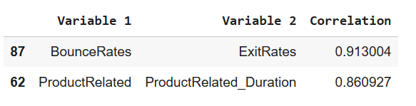
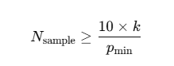
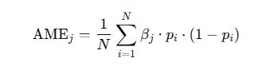

# Regression Analysis: Analyzing Factors Associated with Online Customer Purchase Intention
--------------------------------

## 1/ Project Overview ##
**Goal:** In this project, I analyze the factors associated with online customer purchase intention. Understanding these factors helps businesses make effective marketing decisions and focus their efforts on customers who are more likely to make a purchase.

**Method:** Interpreting logistic regression coefficients to quantify the effect of predictors on purchase intention.

**Metadata:** The dataset contains 12,330 sessions, where **Revenue** indicates whether an online visit results in a purchase or not.

| Feature | Type | Description |
|--------|------|-------------|
| Revenue | Target/Categorical | Whether the session resulted in a purchase |
| Administrative | Numerical | Number of administrative pages visited |
| Administrative_Duration | Numerical | Time spent (seconds) on administrative pages |
| Informational | Numerical | Number of informational pages viewed |
| Informational_Duration | Numerical | Time (seconds) on informational pages |
| ProductRelated | Numerical | Count of product-related pages |
| ProductRelated_Duration | Numerical | Time (seconds) on product-related pages |
| BounceRates | Numerical | Avg. bounce rate of visited pages |
| ExitRates | Numerical | Avg. exit rate at pages |
| PageValues | Numerical | Avg. page value before purchase |
| SpecialDay | Numerical | Closeness to a special day |
| Month | Categorical | Session month |
| OperatingSystems | Categorical | Visitor OS |
| Browser | Categorical | Visitor browser type |
| Region | Categorical | Visitor geographic region |
| TrafficType | Categorical | Source of traffic |
| VisitorType | Categorical | New, Returning, Other |
| Weekend | Categorical | Weekday vs Weekend visit |

## 2/ Project Workflow ##

  

**Train a Logistic Regression Model:** Fit the data with a logistic regression model.

**Assumption check:** Check whether the model satisfies the six assumptions of logistic regression:

**1.** The response variable is binary.

**2.** The observations are independent.

**3.** There is no multicollinearity among explanatory variables.

**4.** There are no extreme outliers.

**5.** There is a linear relationship between the explanatory variables and the logit of the response variable.

**6.** The sample size is sufficiently large.

**Model refinement:** When any assumption is violated, appropriate tests or feature engineering techniques are applied.

**Interpretation of coefficients:** Model coefficients and p-values are interpretable once all assumptions are satisfied.

## 3/ Assumption Check and Refinement ##
### Assumption 1: The response variable is binary ###

  

The Target feature **Revenue** is a binary feature with 2 values: **1** and **0**, where **1** means the session resulted in a purchase and **0** means the session has no purchase. **=> Assumption 1 is satisfied**

### Assumption 2: The observations are independent ###

According to the dataset information from the UCI Machine Learning Repository, the dataset was constructed so that each session belongs to a different user within a one-year period. This design prevents any bias toward a specific campaign, special day, user profile, or time period. ([SOURCE](https://archive.ics.uci.edu/dataset/468/online+shoppers+purchasing+intention+dataset)) **=> Assumption 2 is sastified**

### Assumption 3: There is No Multicollinearity Among Explanatory Variables ###

To check for multicollinearity among independent features, I examined the correlation matrix and calculated the Variance Inflation Factor (VIF) for each feature.

  

According to the Pearson correlation, *BounceRates* and *ExitRates* are highly correlated **(0.91)**, and *ProductRelated* and *ProductRelated_Duration* also show a strong correlation **(0.86)**.

<table align="center">
  <tr>
    <th>Feature</th>
    <th>VIF</th>
  </tr>
  <tr>
    <td align="center">ProductRelated</td>
    <td align="center">4.430363</td>
  </tr>
  <tr>
    <td align="center">ProductRelated_Duration</td>
    <td align="center">4.330691</td>
  </tr>
  <tr>
    <td align="center">BounceRates</td>
    <td align="center">6.410740</td>
  </tr>
  <tr>
    <td align="center">ExitRates</td>
    <td align="center">7.151757</td>
  </tr>
</table>

Besides Pearson correlation, the Variance Inflation Factor (VIF) test is also a useful method to detect multicollinearity. As expected, the features *ProductRelated*, *ProductRelated_Duration*, *BounceRates*, and *ExitRates* exhibit relatively high VIF scores, ranging from **4.4** to **7.1**.

**=> These four features should be preprocessed to satisfy Assumption 3.**

**Refinement:** 

While both *BounceRates* and *ExitRates* are related to how customers leave a page and are measured on the same scale (0–1), I created a new feature called *EngagementIndex*. This feature reflects the level of user engagement, with higher values indicating that users are more likely to stay and interact with the page. It can be calculated using the following formula:

  

For *ProductRelated* and *ProductRelated_Duration*, I could not merge these two features because they are not measured on the same scale. Therefore, I removed one of them; in this case, *ProductRelated* was removed because it had a higher **VIF score (4.4 > 4.3)**.

After that, I used the Pearson correlation again to check for correlations. This time, none of the independent features had **a correlation higher than 0.7**. I also performed the VIF test again, and none of the features had **a VIF score higher than 1**.

<table align="center">
  <tr>
    <th>Variable</th>
    <th>VIF</th>
  </tr>
  <tr>
    <td align="center">ProductRelated_Duration</td>
    <td align="center">1.081645</td>
  </tr>
  <tr>
    <td align="center">Month</td>
    <td align="center">1.016627</td>
  </tr>
  <tr>
    <td align="center">OperatingSystems</td>
    <td align="center">1.158841</td>
  </tr>
  <tr>
    <td align="center">Browser</td>
    <td align="center">1.148238</td>
  </tr>
  <tr>
    <td align="center">Region</td>
    <td align="center">1.022907</td>
  </tr>
  <tr>
    <td align="center">TrafficType</td>
    <td align="center">1.077766</td>
  </tr>
  <tr>
    <td align="center">Weekend</td>
    <td align="center">1.007259</td>
  </tr>
  <tr>
    <td align="center">VisitorType_Other</td>
    <td align="center">1.300107</td>
  </tr>
  <tr>
    <td align="center">VisitorType_Returning_Visitor</td>
    <td align="center">1.167817</td>
  </tr>
  <tr>
    <td align="center">EngagementIndex</td>
    <td align="center">1.149975</td>
  </tr>
</table>

**=> Assumption 3 is satisfied**

### Assumption 4: There are No Extreme Outliers ###

Values below the first quartile or above the third quartile were treated as outliers.

<table align="center">
  <tr>
    <th>Feature</th>
    <th>Total Outliers</th>
  </tr>
  <tr>
    <td align="center">BounceRates</td>
    <td align="center">1551</td>
  </tr>
  <tr>
    <td align="center">ExitRates</td>
    <td align="center">1099</td>
  </tr>
  <tr>
    <td align="center">PageValues</td>
    <td align="center">2730</td>
  </tr>
  <tr>
    <td align="center">SpecialDay</td>
    <td align="center">1251</td>
  </tr>
  <tr>
    <td align="center">Administrative</td>
    <td align="center">404</td>
  </tr>
  <tr>
    <td align="center">Administrative_Duration</td>
    <td align="center">1172</td>
  </tr>
  <tr>
    <td align="center">Informational</td>
    <td align="center">2631</td>
  </tr>
  <tr>
    <td align="center">Informational_Duration</td>
    <td align="center">2405</td>
  </tr>
  <tr>
    <td align="center">ProductRelated</td>
    <td align="center">987</td>
  </tr>
  <tr>
    <td align="center">ProductRelated_Duration</td>
    <td align="center">961</td>
  </tr>
</table>

**Refinement:** These outlier values were all removed. One drawback of this approach is that the variables *PageValues* and *SpecialDay* became unusable, as they contained only zeros after filtering. Therefore, both variables were also dropped from the dataset.

**=> Assumption 4 is satisfied**

### Assumption 5: There is a Linear Relationship Between Explanatory Variables and the Logit of the Response ###

I used the **Box-Tidwell test** to check whether there is a linear relationship between the independent features and the log-odds of the target variable.

  

 0.05** means there is a linear relationship **=>** *Administrative_Duration_log, Administrative_log, Informational_log, Informational_Duration_log,  ProductRelated_log* are not linear.

**Refinement:** Features with **p-values less than 0.05** were removed to satisfy Assumption 5.

  

 Assumption 5 is satisfied** 

### Assumption 6: The Sample Size is Sufficiently Large ###
I used the rule of thumb to calculate the minimum required sample size for the model. The formula is as follows:

  

| Symbol       | Meaning                                                                                  |
|--------------|------------------------------------------------------------------------------------------|
| N_sample     | Total sample size required for the logistic regression model                             |
| k            | Number of explanatory variables (independent features) in the model                     |
| p_min        | Probability (or proportion) of the least frequent outcome of the target variable        |
| 10           | Rule of thumb: at least 10 “events” per variable to ensure stable coefficient estimates |

The required sample size is **2,403.86**, while the actual number of observations in my dataset is **6,851**. This indicates that the dataset has a sufficient sample size to meet Assumption 6.

**=> Assumption 6 is satisfied**

## 4/ Interpretation of coefficients ##

While the logistic regression model satisfies all assumptions, its coefficients can be meaningfully interpreted.
The model summary is shown below:

  

I focused only on features with p-values (P>/z/) less than 0.05, which indicates that their associations with purchase intention are statistically significant.

There are 3 features with p-values less than 0.05: **ProductRelated_Duration, Month, VisitorType_Returning_Visitor**

The coefficient shows how much the log-odds change when x increases by one unit. However, the concept of log-odds is often difficult for stakeholders to understand. Therefore, I calculated the Average Marginal Effect (AME), which measures the change in the probability of the outcome.

  

| Symbol       | Meaning                                                                                  |
|--------------|------------------------------------------------------------------------------------------|
| AME          | Average Marginal Effect                             |
| N            | Number of observations                                                                   |
| p_i          | Predicted probability for observation i                                                  |
| β_j           | Logistic regression coefficient for x_j                                                 |

**. ProductRelated_Duration:** The AME of ProductRelated_Duration is 1.8e-05, indicating that a one-unit increase in this variable is associated with an average increase of 0.0018% in the probability of purchase intention, holding other variables constant. **=> The longer a customer spends viewing related products (ProductRelated_Duration), the higher the probability of making a purchase. However, the effect is very small.**

**. Month:** A one-unit increase in month (i.e., moving one month closer to the end of the year) is associated with a 0.47% increase in purchase probability, holding other variables constant **=> Customers tend to have higher purchase intention toward the end of the year.**

**. VisitorType_Returning_Visitor:** The AME of VisitorType_Returning_Visitor is −0.0356, indicating that being a returning visitor is associated with an average decrease of 3.56 percentage points in the probability of purchase intention, compared to a new visitor, holding other variables constant. **=> This variable shows the strongest association with purchase intention. Returning visitors tend to have a lower probability of making a purchase than other types of customers.**

## 5/ Conclusion ##
Correlation does not equal causation, so the company should not make major operational or marketing decisions based only on these results. Nevertheless, the analysis highlights hypotheses worth investigating further to tackle key business challenges.

### Q1: Why are returning visitors less likely to make a purchase? ###

**- The customer is undecided:** While they appear interested in the product, they are concerned about the price or the seller's credibility. 

**- The website lacks a user-friendly interface:** An unfriendly UI/UX can make customers feel less engaged with the products, which may reduce the likelihood of purchase each time they return.

**- Returning visitors may simply be the result of repeated ad exposures:** Customers may view products multiple times due to ads run in collaboration with game platforms and YouTube. This can cause them to be classified as returning visitors, even without any real purchase intention.

**=> For return visitors, a small pop-up can be displayed showing the product they viewed previously, emphasizing the limited stock remaining to create a sense of scarcity.**

### Q2: Why are customers more likely to make purchases toward the end of the year? ###

At the end of the year, many customers replace old products with new ones, particularly trendy items like fashion. The company can leverage the end-of-year period to launch promotional campaigns for old products while ramping up the procurement of new items. 

### Q3: What can we gain from the relationship between purchase intention and time spent on related products? ###
The effect of this variable on purchase intention is minimal, so advanced methods like causal inference may be needed to guide strategy.
