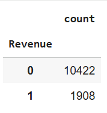

# Regression Analysis: Analyzing Factors Associated with Online Customer Purchase Intention
---

## 1/ Project Overview ##
**Goal:** In this project, I analyze the factors associated with online customer purchase intention. Understanding these factors helps businesses make effective marketing decisions and focus their efforts on customers who are more likely to make a purchase.

**Method:** Interpreting logistic regression coefficients to quantify the effect of predictors on purchase intention.

**Metadata:** The dataset contains 12,330 sessions, where **Revenue** indicates whether an online visit results in a purchase or not.

| Feature | Type | Description |
|--------|------|-------------|
| Revenue | Target/Categorical | Whether the session resulted in a purchase |
| Administrative | Numerical | Number of administrative pages visited |
| Administrative_Duration | Numerical | Time spent (seconds) on administrative pages |
| Informational | Numerical | Number of informational pages viewed |
| Informational_Duration | Numerical | Time (seconds) on informational pages |
| ProductRelated | Numerical | Count of product-related pages |
| ProductRelated_Duration | Numerical | Time (seconds) on product-related pages |
| BounceRates | Numerical | Avg. bounce rate of visited pages |
| ExitRates | Numerical | Avg. exit rate at pages |
| PageValues | Numerical | Avg. page value before purchase |
| SpecialDay | Numerical | Closeness to a special day |
| Month | Categorical | Session month |
| OperatingSystems | Categorical | Visitor OS |
| Browser | Categorical | Visitor browser type |
| Region | Categorical | Visitor geographic region |
| TrafficType | Categorical | Source of traffic |
| VisitorType | Categorical | New, Returning, Other |
| Weekend | Categorical | Weekday vs Weekend visit |

## 2/ Project Workflow ##

  

**Train a Logistic Regression Model:** Fit the data with a logistic regression model.

**Assumption check:** Check whether the model satisfies the six assumptions of logistic regression:

**1.** The response variable is binary.

**2.** The observations are independent.

**3.** There is no multicollinearity among explanatory variables.

**4.** There are no extreme outliers.

**5.** There is a linear relationship between the explanatory variables and the logit of the response variable.

**6.** The sample size is sufficiently large.

**Model refinement:** When any assumption is violated, appropriate tests or feature engineering techniques are applied.

**Interpretation of coefficients:** Model coefficients and p-values are interpretable once all assumptions are satisfied.

## 3/ Assumption Check ##
### Assumption 1: The response variable is binary ###

  

The Target feature **Revenue** is a binary feature with 2 values: **Yes** and **No**, where **Yes** means the session resulted in a purchase and **No** means the session has no purchase. **=> Assumption 1 is satisfied**
